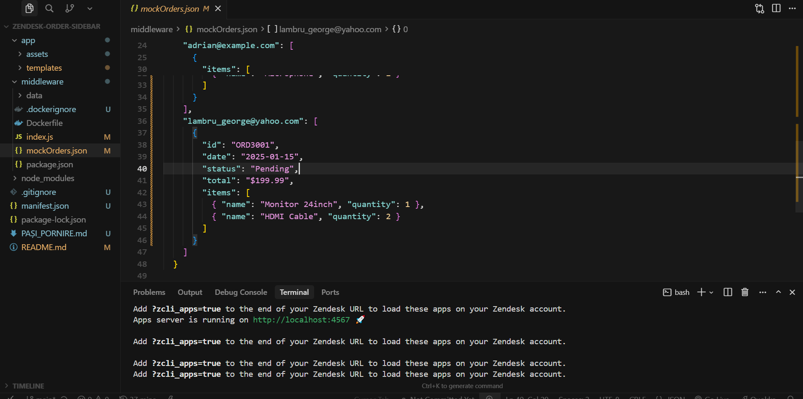
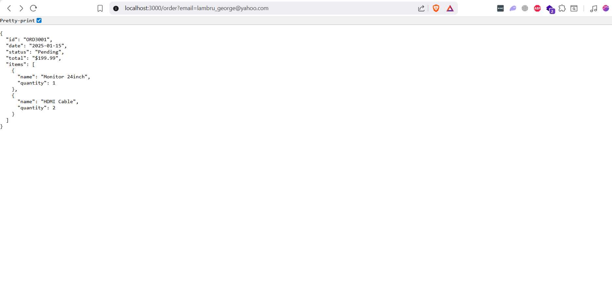
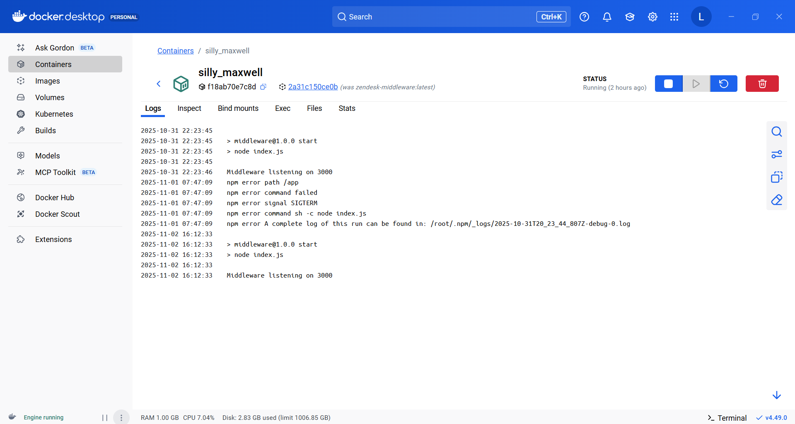
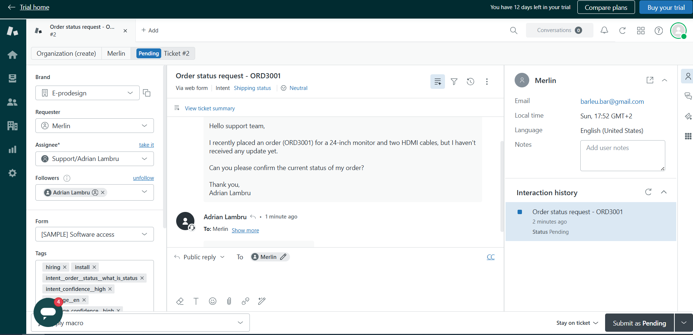

# Zendesk Order Sidebar App






A Zendesk sidebar application built with ZAF v2 that displays customer order information in tickets. Features automatic requester email detection, order fetching, internal comment posting, and AI-powered ticket processing.

## Features

- ✅ Automatically reads requester email from ticket
- ✅ Displays latest order (ID, date, status, total, items)
- ✅ Posts order details as internal comment
- ✅ AI-powered ticket comment processing with automatic summary posting

## Architecture

```
Zendesk Sidebar App → Middleware (Docker) → Mock Orders (JSON)
```

**Components:**
- **Zendesk App** (`/app/`) - Sidebar UI and logic
- **Middleware** (`/middleware/`) - Express server with order and AI endpoints
- **Mock Data** (`mockOrders.json`) - Simulated order data

## Quick Start

### 1. Start Middleware

```bash
cd middleware
docker build -t zendesk-middleware .
docker run -p 3000:3000 zendesk-middleware
```

Test: http://localhost:3000/order?email=john@example.com

**Alternative (no Docker):**
```bash
cd middleware
npm install
npm start
```

### 2. Setup Zendesk CLI

```bash
# Install ZCLI
npm install -g @zendesk/zcli

# Login
zcli login -i
# Enter: subdomain (part before .zendesk.com), email, password/token

# Start development server
zcli apps:server
# Press Enter for middlewareUrl (uses http://localhost:3000)
```

### 3. Load App in Zendesk

1. Open a ticket in Zendesk
2. **Add `?zcli_apps=true` to the URL:**
   ```
   https://your-subdomain.zendesk.com/agent/tickets/1?zcli_apps=true
   ```
3. Refresh the page - app should appear in right sidebar

## Configuration

Edit `middleware/mockOrders.json` to add test orders:

```json
{
  "email@example.com": [
    {
      "id": "ORD1001",
      "date": "2025-01-15",
      "status": "Pending",
      "total": "$199.99",
      "items": [{"name": "Product", "quantity": 1}]
    }
  ]
}
```

Restart Docker container after changes.

## API Endpoints

### GET /order?email={email}
Returns latest order for an email.

**Example:**
```bash
curl http://localhost:3000/order?email=john@example.com
```

### POST /ai-summary
Processes ticket text and returns summary.

**Request:**
```json
{"text": "Ticket description..."}
```

## Troubleshooting

| Issue | Solution |
|-------|----------|
| App not appearing | Add `?zcli_apps=true` to URL, check ZCLI server running |
| No order found | Verify email exists in `mockOrders.json`, check middleware running |
| CORS errors | Verify middleware on port 3000, restart Docker container |
| ZCLI login fails | Check subdomain (must match URL exactly), try password instead of token |

**Quick checks:**
- Middleware: http://localhost:3000/order?email=test@example.com
- Docker: `docker ps` to verify container running
- ZCLI: Terminal with `zcli apps:server` must stay open
- Browser: F12 console for JavaScript errors

## Project Structure

```
zendesk-order-sidebar/
├── app/
│   ├── assets/main.js       # App logic
│   ├── assets/style.css     # Styling
│   └── templates/iframe.html
├── middleware/
│   ├── index.js             # Express server
│   ├── mockOrders.json     # Test data
│   └── Dockerfile
└── manifest.json            # Zendesk config
```

## Requirements Met

✅ Zendesk App with ZAF v2  
✅ Reads requester email automatically  
✅ Middleware Docker container  
✅ GET /order endpoint  
✅ Mock API (JSON data)  
✅ Display orders in sidebar  
✅ Post internal comment  
✅ AI processing  
✅ Complete documentation  

## Tech Stack

- **Middleware:** Node.js, Express, CORS, Body-parser
- **Zendesk App:** ZAF SDK v2.0
- **Container:** Docker

## Production Deployment

1. Deploy middleware container to cloud (AWS/Azure/GCP)
2. Update `app/assets/main.js` with production middleware URL
3. Package app: `zcli apps:package`

---

**Built for Zendesk Developer test**
